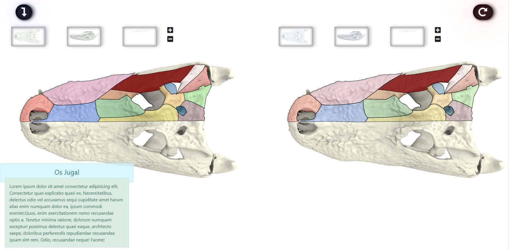

# 2d_models_viewers_comparator
A 2D models generator with CANVAS for comparaison et informations display

[Online Demo](http://vag.ovh/2d)
## Display image with interactives zone

This project responds to specifics needs. The purpose is to draw an image on canvas and draw over this image interactive and colorized zones to display informations corresponding to these zone.
The said zones are done this way : From the image we draw shapes on layers and export the layer only. Then we build the points to points to redraw them with JS on the CANVAS

check the json's within this project to understand the way it's build

## Features

- Display an image as canvas
- Add interactive zones wichs display information on mouse over 
- Compare to 2D models and make the interraction on the zone communicate with the other model
- Change display for comparison mode (horizontal, vertical)

## Tech

I use several libraries. Only one is mandatory, of course : [model-viewer](https://modelviewer.dev/)

##### For lazyness
- Bootstrap 5.1
- Font-Awesome

## How to use

You can use the project as is or make your own with only ``` js/CanvasBuilder.js```

Inside you page create an empty div, name it however you want but it has to have an ID
```html
<div id="app-wrapper" class="d-flex mt-5"> <!-- wrapps the whole "app" to call it like that -->
        <i class="fas fa-level-down-alt" id="orientator"></i> <!-- change orientation when comparison mode is activated -->
      
      <div id="canvas" class="mt-5"> <!-- first canvas -->
        <canvas id="model"></canvas>  
        <div id="popup" class="alert alert-info"></div> <!-- this is where the information will be displayed -->
      </div>

      <div id="canvas2" class="mt-5"> <!-- second canvas -->
        <canvas id="model2"></canvas>  
      </div>
    </div>
    
    
    
    <i class="fas fa-binoculars" id="binoculars"></i> <!-- button to launch comparison mode -->

    <i class="fas fa-redo-alt" id="reload"></i> <!-- button to close the comparator (remove()) -->
```

And instantiate the canvas in you JS script

```js
//You first need to create an array of object, each have the path to the image and the points of interests JSON's path
//You also need to declare a variable zoneName with an empty string (or let)
let zoneName;
const models = [
    {
        img:'assets/img/Alligator_dorsal.png',
        json:'assets/json/ALLIGATOR_Dorsal_patches_metadata.json',
        thumb:'',
    },
    {
        img:'assets/img/Alligator_lateral.png',
        json:'assets/json/ALLIGATOR_Lateral_patches_metadata.json',
        thumb:'',
    },
    {
        img:'assets/img/Alligator_ventral.png',
        json:'assets/json/ALLIGATOR_Ventral_patches_metadata.json',
        thumb:'',
    }
];

const canva = new CanvasBuilder("canvas", "model", models, 0.5) //instanciate the object
canva.buildCanvas() //display it

let canva2; //prepare for the comparison one
/*
* if you want a comparison model. Else do not invoke this
*/
binoculars.addEventListener('click', (e)=>{ 
    // create && add a comparative viewer
    canva2 = new CanvasBuilder("canvas2", "model2", models, 0.5)
    canva2.buildCanvas()
    binoculars.style.display='none'
    reload.style.display = "block"

    canva.canvas.onmousemove = (e) =>{
        canva2.handleZoneName(zoneName);
    }


    canva2.canvas.onmousemove = (e) =>{
        canva.handleZoneName(zoneName);
    }

    // canva2.canvas.onmouseleave = (e) =>{
    //     canva.buildCanvas()
    // }
    
})

reload.addEventListener('click', (e)=>{
    e.preventDefault()
    // document.getElementById(canva2.parent).style.display ="block"
    document.getElementById(canva2.div).remove()
    document.getElementById('wrappercanvas2').remove()
    e.target.style.display="none"
    binoculars.style.display="block"
})

```

## Things to come ?
It's only early developpement so even if it's functionnal it'll evolve as to propose parameters like choosing which options one's want and stuff.
Also making it a React component will probably be done

## Preview

